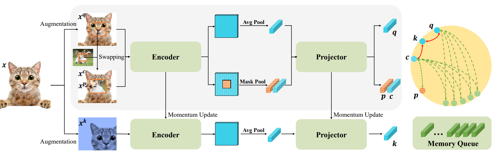

<h1 align="left">RegionCL: Can Simple Region Swapping Contribute to Contrastive Learning? <a href="https://arxiv.org/abs/2111.12309">.svg" ></a>
</a> </h1> 

  <a href="#introduction">Introduction</a> |
  <a href="#results">Results</a> |
  <a href="#installation">Installation</a> |
  <a href="#news">News</a>

## Introduction

This repository contains the code, models, test results for the paper <a href="https://arxiv.org/abs/2111.12309">RegionCL: Can Simple Region Swapping Contribute to Contrastive Learning?</a>. It contains a simple region swapping module to construct both global- and region-level contrastive pairs with minor modifications to current self-supervised methods, e.g., MoCov2, DenseCL, SimSiam, and so on.

## Results

We test RegionCL-M/D/S on the ImageNet dataset for classification, MS COCO dataset for detection, instance segmentation and human pose estimation, Cityscapes dataset for instance and semantic segmentation, and AP-10K dataset for animal pose estimation. The results and training logs are available below.

### Pretrain & Classification on ImageNet-1K
| Model | Pretrain | IN1K Linear | 
| :---: | :---: | :---: |
| RegionCL-M | [log](./logs/RegionCLM/RegionCLM.log) \| [config](configs/selfsup/regionCL-M/regionCLM-r50.py) | 69.4 \| [log](./logs/RegionCLM/Linear-RegionCLM.log) |
| RegionCL-D | N/A | 68.5 \| N/A |
| RegionCL-S | N/A | 71.3 \| N/A | 

### MaskRCNN detection and segmentation on MS COCO
| Model | MS COCO Det&Seg C4 1x | MS COCO Det&Seg FPN 1x | 
| :---: | :---: | :---: |
| RegionCL-M | 39.8&34.8 \| [log](./logs/RegionCLM/MaskRCNN-C4-RegionCLM-1x.log) | 40.1&36.3 \| [log](logs/RegionCLM/MaskRCNN-FPN-RegionCLM-1x.log) |
| RegionCL-D | 40.3&35.2 \| N/A | 40.4&36.7 \| N/A |
| RegionCL-S | 38.7&33.7 \| N/A | 38.8&35.2 \| N/A |

| Model | MS COCO Det&Seg C4 2x | MS COCO Det&Seg FPN 2x | 
| :---: | :---: | :---: |
| RegionCL-M | 41.5&35.9 \| [log](./logs/RegionCLM/MaskRCNN-C4-RegionCLM-2x.log) | 41.6&37.7 \| [log](logs/RegionCLM/MaskRCNN-FPN-RegionCLM-2x.log) |
| RegionCL-D | 41.8&36.4 \| N/A | 42.1&38.0 \| N/A |
| RegionCL-S | 40.7&35.4 \| N/A | 41.0&37.1 \| N/A |

### RetinaNet detection on MS COCO
| Model | MS COCO Det 1x | MS COCO Det 2x | 
| :---: | :---: | :---: |
| RegionCL-M | 38.4 \| [log](logs/RegionCLM/RetinaNet-RegionCLM-1x.log) | 40.1 \| [log](logs/RegionCLM/RetinaNet-RegionCLM-2x.log) |
| RegionCL-D | 38.8 \| N/A | 40.6 \| N/A |
| RegionCL-S | 36.8 \| N/A | 39.1 \| N/A |

### Instance and semantic segmentation on Cityscapes
| Model | MaskRCNN Inst-Seg | UperNet Sem-Seg 40K | UperNet Sem-Seg 80K |
| :---: | :---: | :---: | :---: |
| RegionCL-M | 34.9 \| [log](logs/RegionCLM/CityScape-AP-RegionCLM.log) | 78.1 \| [log](logs/RegionCLM/CityScape-UperNet-RegionCLM-40k.log) | 79.0 \| [log](logs/RegionCLM/CityScape-UperNet-RegionCLM-80k.log) |
| RegionCL-D | 34.8 \| N/A | 78.7 \| N/A | 79.5 \| N/A |
| RegionCL-S | 34.9 \| N/A | 77.8 \| N/A | 78.7 \| N/A |

### SimpleBaseline pose estimation on MS COCO and AP-10K
| Model | Human Pose | Animal Pose |
| :---: | :---: | :---: |
| RegionCL-M | 72.3 | 70.6 |
| RegionCL-D | 73.6 | 72.1 |
| RegionCL-S | 72.2 | 71.6 |

## Installation

The code is based on [Openselfsup](https://github.com/open-mmlab/mmselfsup), thanks for their wonderful work!

Requirements:

- Python 3.6.5+
- Pytorch (version 1.7.0)
- mmcv (version 1.0.3)

1. Install mmcv following the requirements as in [link](https://github.com/open-mmlab/mmcv/tree/v1.0.3)

2. Clone this repository

    `git clone https://github.com/Annbless/RegionCL.git`

3. Go into the repository

    `cd RegionCL`

4. Install this repository

    `pip install -v -e .`

## News

***2021/12/30*** Release the code and results for RegionCL-M

### To do

- [ ] Release the code and logs for RegionCL-D and RegionCL-S
- [ ] Release the pretrained models
- [ ] Release the RegionCL with more self-supervised methods

